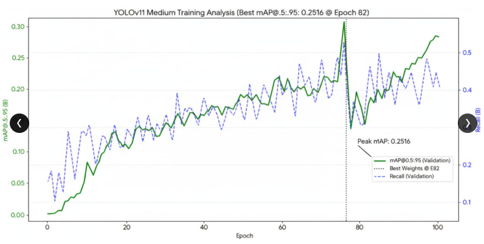
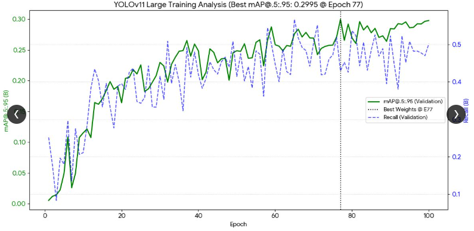
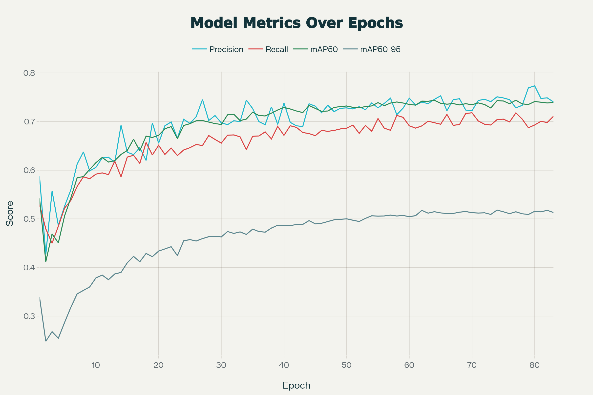
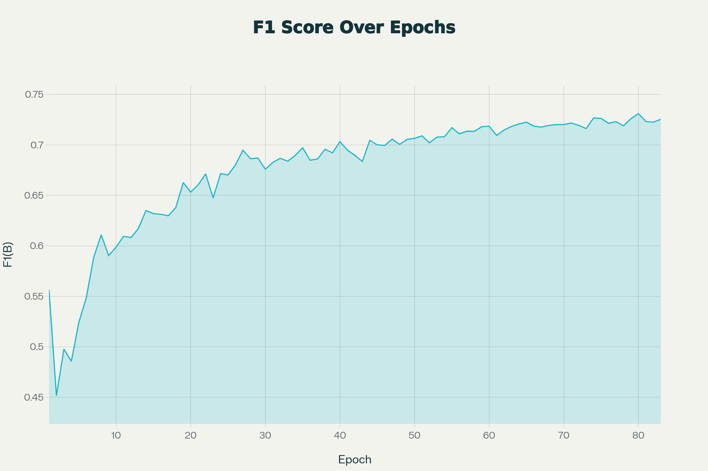

# 📓 Model Training & Experimentation Log

This document serves as a comprehensive log of the iterative training process, dataset curation, hyperparameter tuning, and metric evaluations conducted to achieve optimal weed detection performance.

## 1. Initial Dataset Setup & Baseline Training
*   **Environment:** Google Colab (GPU enabled), Python.
*   **Frameworks:** Ultralytics (YOLO11, YOLOv8).
*   **Initial Dataset Composition:** 873 total images across 3 initial classes.
    *   *Parthenium hysterophorus*: 630 images
    *   *Pigweed*: 198 images
    *   *Jungle weed*: 45 images
*   **Baseline Model:** YOLOv8 medium (`yolov8m.pt`) and YOLO11 medium (`yolo11m.pt`).
*   **Baseline Parameters:** 50 Epochs, Batch Size 16, Image Size (imgsz) 640.
*   **Initial Results:** 
    *   Precision (B): 0.735
    *   Recall (B): 0.6603
    *   mAP@50 (B): 0.7146
    *   mAP@50-95 (B): 0.4848

## 2. Dataset Rebalancing & Early Challenges
*   **Dataset Split:** Restructured dataset for proper validation (70% Train, 20% Val, 10% Test).
*   **Observation:** Initial testing on unseen samples yielded false detections and missed true targets due to severe class imbalance, particularly for Jungle weed.
*   **Intervention:** Applied custom Python data augmentation scripts to pad underrepresented classes, expanding the preliminary set to 1,076 images.
*   **Mid-Training Results (100 Epochs):**
    *   Precision (B): 0.495
    *   Recall (B): 0.460
    *   mAP@50 (B): 0.430
    *   mAP@50-95 (B): 0.21971

## 3. Advanced Augmentation & Hyperparameter Tuning
To combat false detections and improve feature learning for smaller objects, aggressive augmentation parameters were introduced:
*   **Mosaic Augmentation:** 1.0 (Forces the model to recognize smaller objects by feeding 4 images as one).
*   **Mixup Augmentation:** 0.2 (Blends two images and labels together to reduce overfitting).
*   **Patience (Early Stopping):** Increased from 25 to 300 to allow the model to train for longer hours and extract deeper details without terminating prematurely.
*   **Observation:** Augmentation initially caused a slight performance drop (mAP@50 hit 0.4344 at Epoch 76), indicating the model was adjusting to harder, heavily augmented samples.

## 4. Phase 1: Exploration & Model Scaling (October 9, 2025 Run)

To address low recall and evaluate new architectures on an augmented dataset of **4,510 images**, a direct benchmark was conducted between **YOLOv11 Medium** and **YOLOv11 Large** trained over 100 epochs.

### YOLOv11 Medium vs. YOLOv11 Large Comparison

| Metric | Last Run (YOLOv11 Medium) | Current Run (YOLOv11 Large) | Performance Delta |
| :--- | :--- | :--- | :--- |
| **Best mAP@50** | 0.4697 | **0.5356** (Epoch 82) | +14.0% improvement |
| **Best mAP@50-95** | 0.2516 (Epoch 82) | **0.2995** (Epoch 77) | +19.0% improvement |
| **Precision** | **0.6290** | 0.6180 | Slight trade-off |
| **Recall** | 0.3850 | **0.4290** | +11.4% improvement |

  
  

### Analytical Insights & Bottlenecks
* **Model Scaling Impact:** Scaling from YOLOv11 Medium to Large stabilized recall trends and improved overall mAP@50 to 0.5356.
* **Localization Stagnation:** Despite model capacity increases, localization performance remained capped below $mAP@50\text{--}95 = 0.30$. This confirmed that scaling architecture size without expanding dataset volume and class diversity created a severe performance ceiling.

---

## 5. Phase 2: Final Dataset Scale-Up & Production Model (YOLOv8)
Following insights from the YOLO11 experiments, the dataset was scaled up to **7,518 images** across 5 target weed species (*Parthenium hysterophorus*, *Chenopodium album*, *Amaranthus palmeri*, *Echinochloa colona*, and *Lolium perenne*). The architecture was adapted to **YOLOv8 (medium)** to optimize real-time edge processing speeds.

  
  

* **Final Model Metrics (COCO Standard):**
  * **Precision:** 70.04%
  * **Recall:** 63.81%
  * **mAP@50-95:** 44.47%
* **Hardware Benchmarking:** Evaluated on an NVIDIA T4 GPU (768px resolution), yielding an inference latency of **32.6ms (30.6 FPS)**.
* **Portability & Edge Strategy:** 
  * Exported weights to **ONNX** format.
  * Solved mobile/edge hardware constraints by setting up a centralized backend inference engine tunneled via **ngrok**, offloading heavy computing tasks from low-power devices.

## 6. Key Engineering Takeaways
*   **Performance:** Achieved robust real-time object detection capability suitable for live web-camera integration and field deployment.
*   **Convergence & Metric Tracking:** Relied on IoU thresholds (0.50 to 0.95) to evaluate localization accuracy while monitoring Training vs. Validation Loss to prevent overfitting.
*   **Hardware:** Verified that GPU acceleration is essential for both real-time web-camera inference and large-scale dataset training.